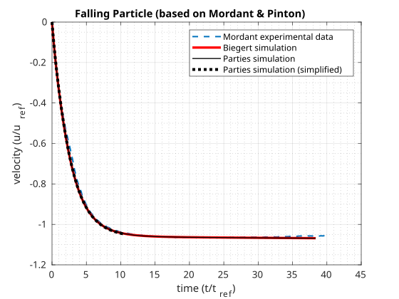

# Documentation for Mordant-Testcase

The simulations that were carried out for this testcase are based on the simulations conducted by Biegert in his dissertation (2018, which in turn are based on the experiments of Mordant & Pinton (2000). The present testcase reproduces the simulations of Biegert for the case with a Reyndolds number of 41. The corresponding parameters as well a plot illustrating the data can be found in the dissertation of Biegert (Table 3.1, page 24, and Figure 3.3, page26). The simulation data of Biegert (that are matching the experimental data) could be reproduced using the PARTIES code. However, a simulation with the original setup takes several hours on 24 cores and is therefore not suitable for a testcase. Because of that, the setup was simplified in order to end up with a simulation time of several minutes. The input files of the original setup can be found in the folder "Files_Original_Testcase". In order to illustrate the simplifications that have been made, a table below is presented. Note that the parameters that are not presented within the table have not been changed.

Parties Input File | Parameter | Original Setup | Simplified Setup
:-: | :-: | :-: | :-: |
parties.inp | xmax  | 1.25 | 0.65
parties.inp | ymax | 1.25 | 0.65
parties.inp | zmax | 10 | 2.5
parties.inp | NXM | 150 | 78
parties.inp | NYM | 150 | 78
parties.inp | NZM | 1200 | 300
parties.inp | time_max | 5 | 1.3
parties.inp | output_time_interval | 4 | 1
parties.inp | max_dt | 1e-2 | 1e-1 
parties.inp | default_dt | 1e-5 | 1e-2
parties.inp | constant_dt | 0 | 1
p_mobile.inp | position | 0.625 0.625 9 | 0.325 0.325 2

## Files of the testcase
Boundary_Mordant.h (corresponds to the Boundary.h-File), p_fixed.inp, p_mobile.inp, parties.inp, stop.inp and xdmfWriter.inp

## mordant_testcase.sh
This file starts the testcase (copies the Boundary_Mordant.h-File to the coressponding location, asks for number of processors for run etc.).

## mordant_testcase.py
Carries out the final validation (is called automatically by the mordant_testcase.sh-script).

## reference_data.dat
Contains the data against which the data that are calculated during testrun are compared.

Important: The original testcase according to Mordant & Pinton requires a relativbely large domain, leading to a long computation time. After it was verified that the PARTIES code can reproduce the experimental data from Mordant & Pinton, the testcase was simplified in order carry out the simulation much faster. The data contained in "reference_data.dat" are the ones from the simplified setup.

## parties_orig.inp, p_mobile_orig.inp
Represent the two "original" input files for the testcase, meaning according to the mordant & Pinton testcase (not simplified).

## reference_data_orig.dat
Contains the original simulation data that was obtained by the original Mordant-Testcase (not simplified).

## plot_reference_vs_simulation_vs_simplified
An svg-graphic that displays the original experimental data (Mordant & Pinton), original simulation data (Biegert), the "new" PARTIES simulation data as well as the data obtained by the simpliefied testcase.

