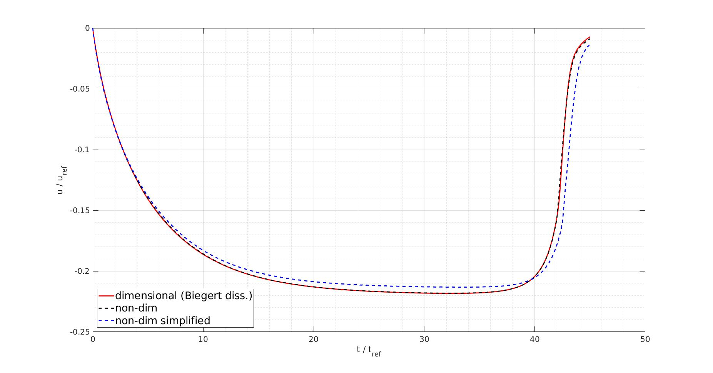

# Documentation for ten Cate-Testcase

The simulations that were carried out for this testcase are based on the simulations conducted by Biegert in his dissertation (2018), which in turn are based on the experiments of ten Cate et al. (2002). The present testcase reproduces the simulations of Biegert for the case of 14 cells per diameter and a Reynolds number of 12 (the simulation paramaters as well as the plot of the results can be found in the dissertation of Biegert in Table 3.1, page 24, and Figure 3.5, page 28). The simulation data of Biegert (that are matching the experimental data of ten Cate) could be reproduced. For the present testcase we established a non-dimensional setup based on the [non-dimensionalization](https://github.com/metialex/PARTIES/blob/metelkin_testcases_fix/PARTIES/testcases/ten_Cate_testcase/tenCate_NonDimensionalization.ods) spreadsheet. 

## Files of the testcase
Boundary_ten_Cate.h (corresponds to the Boundary.h-File), p_fixed.inp, p_mobile.inp, parties.inp, stop.inp and xdmfWriter.inp.

## ten_Cate_testcase.sh
This file starts the testcase (copies the Boundary_Mordant.h-File to the coressponding location, asks for number of processors etc.).

## ten_Cate_testcase.py
Carries out the final validation (is called automatically by the mordant_testcase.sh-script).

## reference_data.dat
Contains the data against which the data that are calculated during testrun are compared.

## parties_orig.inp
Represents the "original" input file for the testcase, meaning according to the ten Cate et al. testcase (not simplified).

## reference_data_orig.dat
Contains the original simulation data that was obtained by the simulation based on the above-mentioned table found in the dissertation of biegert (not simplified, i.e. smaller timesteps).

## parties_nonDim.inp
Represents the non-dimensional input file for the testcase (not simplified).

## p_mobile_nonDim.inp
Represents the non-dimensional input file of the mobile particle for the testcase (not simplified).

## reference_data_nonDim.dat
Contains the simulation data that was obtained by the non-dimensional simulation (not simplified).

## tenCate_NonDimensionalization.ods
Spreadsheet for non-dimensionalizing the physical setup.

## plot_reference_vs_simulation_vs_simplified
The plot displays the comparison of the dimensional simulation of Biegert (red line), the non-dimensional simulation (black dashed line) and the simplified non-dimensional simulation (blue dashed line). Due to the fact that we are able to reproduce the original (dimensional) results with the non-dimensional setup, we accelerate the simulation and accept a mismatch by reducing the domain and increasing the time step. 

