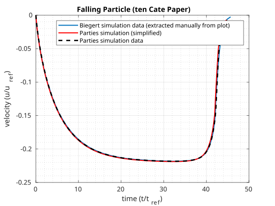

# Documentation for ten Cate-Testcase

Simulations were carried out based on the simulations conducted by Biegert in his dissertation (2018), which in turn were based on the experiments carried out by ten Cate et al. (2002). The present testcase reproduces the simulations of Biegert for the case of 14 cells per diameter and a Reynolds number of 12 (the simulation paramaters as well as the plot of the results can be found in the dissertation of Biegert in Table 3.1, page 24, and Figure 3.5, page 28). The simulation data of Biegert (that are matching the experimental data of ten Cate) could be reproduced using the PARTIES code. However, a simulation with the original setup would take to long for a testcase. Because of that, the setup was simplified in order to end up with a simulation time of several minutes. The input files of the original setup can be found in the folder "Files_Original_Testcase". In order to illustrate the simplifications that have been made, a table below is presented. Note that the parameters that are not presented within the table have not been changed.

Parties Input File | Parameter | Original Setup | Simplified Setup
:-: | :-: | :-: | :-: |
parties.inp | max_dt | 1e-2 | 1e-1 
parties.inp | default_dt | 1e-4 | 1e-2
parties.inp | constant_dt | 0 | 1

## Files of the testcase
Boundary_ten_Cate.h (corresponds to the Boundary.h-File), p_fixed.inp, p_mobile.inp, parties.inp, stop.inp and xdmfWriter.inp.

## ten_Cate_testcase.sh
This file starts the testcase (copies the Boundary_Mordant.h-File to the coressponding location, asks for number of processors etc.).

## ten_Cate_testcase.py
Carries out the final validation (is called automatically by the mordant_testcase.sh-script).

## reference_data.dat
Contains the data against which the data that are calculated during testrun are compared.

## parties_orig.inp
Represents the "original" input file for the testcase, meaning according to the ten Cate et al. testcase (not simplified).

## reference_data_orig.dat
Contains the original simulation data that was obtained by the simulation based on the above-mentioned table found in the dissertation of biegert (not simplified, i.e. smaller timesteps).

## plot_reference_vs_simulation_vs_simplified
An svg-graphic that displays the experimental data extracted from a graph in the dissertation of Biegert (based on the ten Cate et al. simulation with 14 cells per diameter), the "new" PARTIES simulation data as well as the data obtained by the simplified testcase.

