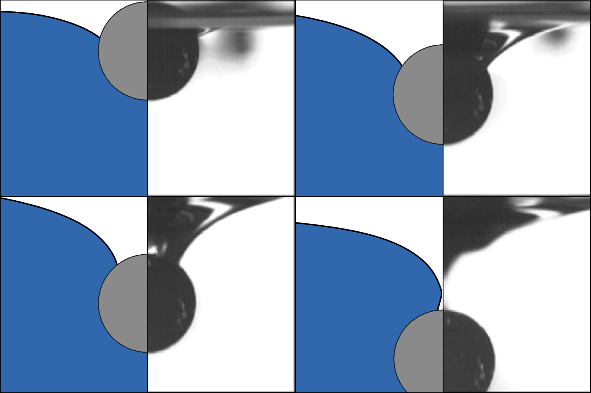

# A Diffuse-Interface Immersed-Boundary Method for Wetting Fluid–Structure Interaction

> **Capillary fluid–structure interaction between incompressible liquid–gas flows and fully resolved rigid bodies.**

**Branch:** `VoF-MaximeJalabert` &nbsp;•&nbsp; **Maintainer:** Maxime Jalabert (PhD Student, UC Santa Barbara) &nbsp;•&nbsp; **Status:** Active research / JCP manuscript in preparation

  

<em>A denser-than-water cylinder sinking from a water surface: present diffuse-interface IBM simulation (blue) next to the experiment of Vella et&nbsp;al.&nbsp;(2006). The moving contact line migrates from the equator toward the top of the cylinder as the meniscus is drawn down.</em>

---

## Overview

This branch extends the grain-resolving single-phase immersed-boundary solver **PARTIES** into a **two-phase wetting fluid–structure interaction solver** for incompressible liquid–gas flows interacting with fully resolved rigid bodies that dynamically cross and deform the interface.

The formulation couples, within a single staggered-grid, low-storage Runge–Kutta cycle, four ingredients:

1. **Conservative diffuse-interface (Cahn–Hilliard) phase field** with variable density and viscosity, advanced with fifth-order WENO advection and an implicit biharmonic interfacial term.
2. **Balanced, potential-form continuum surface-tension force** derived from the liquid–gas chemical potential — no explicit VoF/curvature reconstruction, minimizing parasitic currents.
3. **Direct-forcing immersed boundary** for the moving solids, with the hydrodynamic load recovered from the IBM reaction plus a sharp fictitious-fluid correction (no surface integration over the body).
4. **Characteristic moving-contact-line construction** enforcing a prescribed contact angle on curved immersed boundaries, together with a **continuum capillary force** whose net force and torque feed back into the rigid-body equations.

The Navier–Stokes equations are kept in force-density form (never divided by `ρ`) so that the large density ratios typical of liquid–gas systems are handled robustly. The wetting machinery currently targets **planar two-dimensional and axisymmetric** configurations.

> Built on the resolved-particle immersed-boundary machinery of PARTIES (Biegert et al. 2017, 2018).

---

## Validation & key numbers

The method is validated through a sequence of tests of increasing coupling, from fluid-only benchmarks to fully dynamic wetting FSI.

### Fluid-only and single-phase IBM benchmarks

| Benchmark | Setup | Key result |
|---|---|---|
| **Rising-bubble convergence** (Ding et al. 2007) | Axisymmetric, `Re=100`, `Bo=200`, `ρ_G/ρ_L=10⁻³` | Coarse-grid `C_L` rate **2.01** (ref. 2.02); errors below reference; bubble volume conserved to **< 6×10⁻⁴** |
| **Rising-bubble topology change** (Sussman & Smereka 1997) | Axisymmetric, `120×240` | Pinch-off to a toroidal bubble captured without interface surgery |
| **Rayleigh–Taylor instability** (Ding et al. 2007) | `At=0.5`, `Re=3000`, `200×800` | Spike/bubble front trajectories match the reference |
| **Falling cylinder** (Liu et al. 2017) | Single-phase, `Re=40` | `C_D = 1.64` (**exact** match); `L_r/D = 2.27` (within **1.5%** of 2.30) |

### Wetting fluid–structure interaction

| Benchmark | Setup | Key result |
|---|---|---|
| **Droplet on a cylinder** (Liu & Ding 2015) | `θ_s = 30°–120°`, `200×500` | Contact angle within **1.5%** (e.g. 30°→29.5°, 120°→119.9°); mass conserved to machine precision (vs. ~16% loss without redistribution) |
| **Droplet on a sphere** (gravity-free) | `θ_s = 30°–120°`, `D/h = 20–200` | Capillary/pressure loads cancel: total residual **11% → 0.1%** and volume error **9% → 0.1%**, near **second-order** convergence |
| **Sinking cylinder** (Vella et al. 2006) | `ρ_s = 1.92`, `θ_s = 110°`, `h = 0.01` | Reproduces contact-line migration (`β: π/2 → π`) and trajectory (`y_c ≈ −1.6D`); liquid/gas volumes conserved to **< 0.03%** with no mass-restoration step |
| **Superhydrophobic sphere impact** (Lee & Kim 2008) | `θ_s = 154°`, axisymmetric, `400×600` | Reproduces the **sinking (`ρ_s=2`) vs. bouncing (`ρ_s=1.32`)** bifurcation; penetration depths 1.61 / 1.27 vs. measured 1.54 / 1.30 |
| **Three sinking cylinders** | `ρ_s = 2.5`, `θ_s = 110°`, `1200×600` | Qualitative multi-body demo: robust with multiple moving contact lines and interacting capillary cavities |

---

# PARTIES Documentation  

## Main Information
[Download and Install the code](https://github.com/metialex/PARTIES/blob/master/docs/md_files/download_and_installation.md)  
[Simulation setup](https://github.com/vowinckel/PARTIES/blob/master/docs/md_files/simulation_setup.md)   
[Post-processing](https://github.com/metialex/PARTIES/blob/master/docs/md_files/post_proc.md)  

## Guidelines

[Workflow and branching](https://github.com/vowinckel/PARTIES/blob/master/docs/md_files/guidline.md)  
[Testcases guideline](https://github.com/metialex/PARTIES/blob/master/docs/md_files/test_case_doc.md)  
Writing the code - comments, description of functions  

## Fluid Dynamic Theory
Non-dimensionalization of code  
Eulerian fluid solver  
Lagrangian particle solver  
Concentration field and single-phase flow solver  
Immersed Boundary Method (IBM)  
Momo's IBM  
Turbulence models  

## Numerical 
Finite difference  
Time & space integration  
Boundary & Initial conditions  
Eulerian & Lagrangian solvers  
Paralleliztion of the code  

## Other
[h5ToVTK](https://github.com/metialex/h5ToVTK) - this tool converts PARTIES Eulerian and Lagrangian output .h5 files into .vtk files.  
[Bug reports](https://github.com/metialex/PARTIES/blob/master/docs/md_files/bug_report.md)   
[Main git commands](https://github.com/metialex/PARTIES/blob/master/docs/md_files/git_commands.md)  
[Matlab scripts](https://github.com/metialex/PARTIES/blob/master/docs/md_files/matlab_scripts.md)  
[Testcases](https://github.com/metialex/PARTIES/tree/master/PARTIES/testcases/README_Testcases.md)  
The main description of code structure  
Links to other related applications - e.g. non-dimensionalization calculators, pre- and post-processing scripts. 

# Structure of the documentation
readme.md - main file with links to the main chapters

folder with different .md documents and figures  
folder with related papers and other (preferably published) documents/manuscripts  
other files (presentations, schematis ...) 
