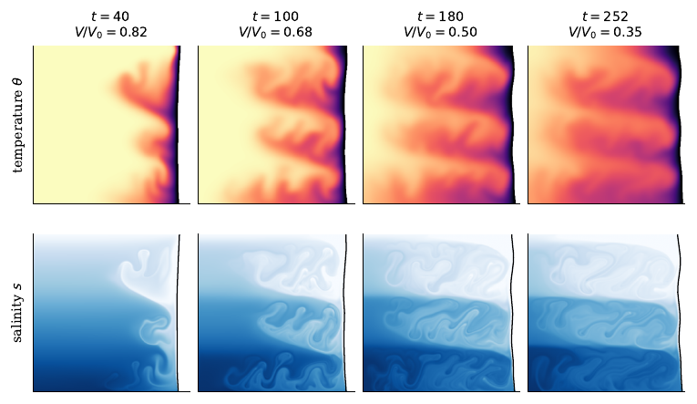

# Phase Change in PARTIES: Ice Melting in Salty Water and Sediment Release

> **Melting of ice in salt-stratified water, and the release of a resolved sediment grain from the melting ice (ECCO).**

**Branch:** `PhaseChange-ECCO` &nbsp;•&nbsp; **Maintainer:** Maxime Jalabert (PhD Student, UC Santa Barbara) &nbsp;•&nbsp; **Status:** Stage A (Yang benchmark) closed 2026-07-30; Stage B 3D shakeout closed 2026-09-08; first production scenario (B.3 P1b) in pre-flight.

  

<em>Salt-stratified lateral melting (Yang et al. 2023, Sm = 5, ΔSv = 5): temperature (top) and salinity (bottom). The stratification splits the flow into stacked convective layers, each with its own cell against the ice, and the ice front becomes scalloped at the layer spacing. V/V0 is the remaining ice volume.</em>

▶ <a href="PHASE_CHANGE_VALIDATION_2026/videos/yang_fields_N432.mp4"><b>Watch the full run (MP4, 432² grid)</b></a>

---

## Overview

This branch adds phase change to the diffuse-interface (Cahn–Hilliard) solver of the [`VoF-MaximeJalabert`](../../tree/VoF-MaximeJalabert) branch (JCP manuscript under review, code tagged `jcp2026-v2`). Ice and water share one Boussinesq fluid; the Cahn–Hilliard field `F` is the liquid fraction, and the ice is held rigid by volume penalization.

The motivation is an ECCO ocean-science question: how sediment carried in ice is released and mixed when the ice melts into salty water. Stage A validates the melting physics; Stage B adds a fully resolved sediment grain that is locked in the ice and released when the ice around it melts.

Every addition is behind a compile flag in `PARTIES/src/Include/Boundary.h`. With the flags off, the code follows the same path as before; this is checked by a regression gate that reproduces the recorded results to every printed digit.

| Flag | Physics |
|---|---|
| `PHASE_CHANGE` | Stefan melting source in the Cahn–Hilliard equation, matching latent-heat sink in the temperature equation, salinity-dependent liquidus |
| `CONC_VOF_PHASEWEIGHTED` | Phase-weighted scalar diffusivity: heat diffuses through both phases, salt stays in the liquid |
| `EOS_NONLINEAR` | Roquet (2015) quadratic equation of state, with the density maximum of cold water |
| `ICE_PENALIZATION` | Darcy/Brinkman damping that keeps the unmelted ice rigid |
| `VOF_IBM` + `LAG_PARTICLE_RESOLVED` | Resolved sediment grain (Stage B), with interface-triggered release (`F_release`, off by default) |
| `VOF_DIFFUSE_SEDIMENT_CH_MASK`, `VOF_DIFFUSE_SHELL_FRACTION_NONSOLID`, `VOF_DIFFUSE_ICE_PENAL_THRESHOLD`, `VOF_DIFFUSE_SEDIMENT_ICE_TRANSPORT`, `ECCO_PROFILES` | Stage B sediment/ice coupling and diagnostics |

A meltwater tracer (third scalar, `meltwater_tracer = 1`) is injected at the interface at the local melt rate, so entrainment of meltwater can be tracked directly.

---

## Validation (Stage A)

Three benchmarks, each switching on more of the flags above.

| Benchmark | Flags | Key result |
|---|---|---|
| **Binary (salty) Stefan problem**, 1D | `PHASE_CHANGE`, `CONC_VOF_PHASEWEIGHTED` | Similarity constant λ = 0.21845 vs exact 0.21714 (**0.6%**); flow stays exactly at rest |
| **Melting Rayleigh–Bénard** (Favier et al. 2019), `Ra = 10⁷` | `PHASE_CHANGE`, `ICE_PENALIZATION` | Diffusive-phase melt rate within **0.9%** of the analytical value; developed melting velocity **−4.8%** from the published DNS (`St = 0.1`); `Nu ∝ Ra_e^{1/3}` scaling reproduced, prefactor 16–19% low |
| **Salt-stratified lateral melting** (Yang et al. 2023, JFM 969 R2) | all four | See below |

**Yang et al. at matched resolution (288², the grid that carries velocity and temperature in the reference):**

| Quantity | PARTIES | Yang et al. | Difference |
|---|---:|---:|---:|
| Freshwater half-melt time `t½` | 102.36 | 107.42 | −4.7% |
| Freshwater `V(200)/V₀` | 0.2447 | 0.2483 | −1.4% |
| Melt-rate ratio `f̄₅/f̄₀` | 0.543 | 0.497 | +9.3% |
| Salt-stratified `t½` | 188.39 | 216 ± 11 | **−12.8%** |

The reference uses two grids (velocity and temperature on 288², salinity and phase field on 1440²); PARTIES uses one. The freshwater case is strongly resolution-dependent (`t½` changes by 70% from 288² to 1440²), while the salt-stratified case is converged (5.4%). The salt-stratified −12.8% is therefore not a resolution effect. It is 2.6σ from a reference value that is itself derived (±4.9%), and it remains unexplained; it is reported, not tuned away. Full account: [`YANG_VALIDATION_SUMMARY.md`](docs/md_files/NASA-JPL/YANG_VALIDATION_SUMMARY.md).

---

## Stage B: sediment released from melting ice

| Step | Status |
|---|---|
| B.0 Non-invasiveness of the resolved-grain build | Passed: Stage-A results reproduced to every printed digit |
| B.1 Hold-in-ice and interface-triggered release, meltwater tracer, sediment/ice mass conservation | Done; the admissibility clip no longer destroys liquid inside the grain (`VOF_DIFFUSE_SEDIMENT_CH_MASK`) |
| B.2 Reduced 3D shakeout | Closed 2026-09-08 ([closure report](docs/md_files/NASA-JPL/YANG_ECCO_B2_CLOSURE_REPORT.md)) |
| B.3 Production scenarios | P1b, a fine-sand grain beneath an Antarctic ice-shelf base: design fixed, pre-flight submitted 2026-09-28 ([record](docs/md_files/NASA-JPL/YANG_ECCO_B3_P1b_SHELF.md)) |

The controlling plan is the [implementation roadmap](docs/md_files/NASA-JPL/YANG_ECCO_IMPLEMENTATION_ROADMAP.md).

---

## Building and running

1. Choose the flags in `PARTIES/src/Include/Boundary.h`. The committed file holds the Yang production configuration; `Boundary.h.stageA` holds the Stage-A gate configuration, and each test case keeps its own `Boundary.*.h` where it differs.
2. Build with `make parties` in `PARTIES/`. Machine-specific compiler and library paths go in an untracked `make.def.<machine>`, selected with `MY_MACHINE=<machine> make parties`; otherwise `make.def.generic` is used.
3. Run `make cleanall` after changing branches: only `Boundary.h` is tracked as a build dependency.

| Folder | Contents |
|---|---|
| [`PARTIES/testcases/ECCO_TESTS/`](PARTIES/testcases/ECCO_TESTS/) | Inputs, job scripts and analysis scripts for every stage (A, B.1, B.2, B.3). Run output lives on scratch, not in git. |
| [`docs/md_files/NASA-JPL/`](docs/md_files/NASA-JPL/) | Roadmap, gate reports, validation summaries |
| [`PHASE_CHANGE_VALIDATION_2026/`](PHASE_CHANGE_VALIDATION_2026/) | Validation manuscript (LaTeX), figure and video scripts, figures |

---

## References

- Yang, R., Howland, C. J., Liu, H.-R., Verzicco, R. & Lohse, D. (2023). Ice melting in salty water: layering and non-monotonic dependence on the mean salinity. *J. Fluid Mech.* 969, R2.
- Favier, B., Purseed, J. & Duchemin, L. (2019). Rayleigh–Bénard convection with a melting boundary. *J. Fluid Mech.* 858, 437–473.
- Roquet, F., Madec, G., Brodeau, L. & Nycander, J. (2015). Defining a simplified yet "realistic" equation of state for seawater. *J. Phys. Oceanogr.* 45, 2564–2579.
- Jalabert, M. & Meiburg, E. (2026). A diffuse-interface immersed-boundary method with continuum capillary forcing for wetting fluid–structure interaction. *J. Comput. Phys.* (under review).

---

# PARTIES Documentation  

## Main Information
[Download and Install the code](https://github.com/metialex/PARTIES/blob/master/docs/md_files/download_and_installation.md)  
[Simulation setup](https://github.com/vowinckel/PARTIES/blob/master/docs/md_files/simulation_setup.md)   
[Post-processing](https://github.com/metialex/PARTIES/blob/master/docs/md_files/post_proc.md)  

## Guidelines

[Workflow and branching](https://github.com/vowinckel/PARTIES/blob/master/docs/md_files/guidline.md)  
[Testcases guideline](https://github.com/metialex/PARTIES/blob/master/docs/md_files/test_case_doc.md)  
Writing the code - comments, description of functions  

## Fluid Dynamic Theory
Non-dimensionalization of code  
Eulerian fluid solver  
Lagrangian particle solver  
Concentration field and single-phase flow solver  
Immersed Boundary Method (IBM)  
Momo's IBM  
Turbulence models  

## Numerical 
Finite difference  
Time & space integration  
Boundary & Initial conditions  
Eulerian & Lagrangian solvers  
Paralleliztion of the code  

## Other
[h5ToVTK](https://github.com/metialex/h5ToVTK) - this tool converts PARTIES Eulerian and Lagrangian output .h5 files into .vtk files.  
[Bug reports](https://github.com/metialex/PARTIES/blob/master/docs/md_files/bug_report.md)   
[Main git commands](https://github.com/metialex/PARTIES/blob/master/docs/md_files/git_commands.md)  
[Matlab scripts](https://github.com/metialex/PARTIES/blob/master/docs/md_files/matlab_scripts.md)  
[Testcases](https://github.com/metialex/PARTIES/tree/master/PARTIES/testcases/README_Testcases.md)  
The main description of code structure  
Links to other related applications - e.g. non-dimensionalization calculators, pre- and post-processing scripts. 

# Structure of the documentation
readme.md - main file with links to the main chapters

folder with different .md documents and figures  
folder with related papers and other (preferably published) documents/manuscripts  
other files (presentations, schematis ...) 
