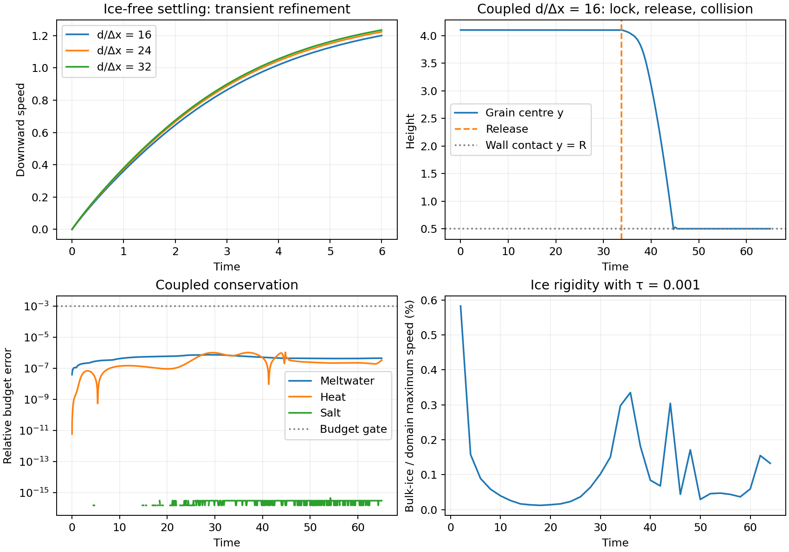

# B.2 closure audit — 2026-09-08

> **B.2 is CLOSED** (user decision, 2026-09-08), on the well-conditioned evidence
> below. The escape-timing limitation is accepted as a **documented constraint on
> B.3**, not as an open defect: it is a property of a grain melting out of its own
> support, not something further refinement removes. The matched-ramp timestep
> comparison is retired as an acceptance item, because it targets that
> ill-conditioned quantity. Timestep convergence is claimed only for the
> well-conditioned quantities listed in
> [What this constrains for B.3](#what-this-constrains-for-b3).

**All B.2 debugging checks pass, re-verified under a solver fix (job 20492853).**
The matched-ramp timestep comparison **20487690** was run and **fails** its
debugging tolerances. Investigating that failure found one genuine solver defect
(now fixed) and one structural limitation that timestep refinement cannot remove:
**the grain's escape from the ice is an ill-conditioned near-cancellation, and its
timing does not converge.** Section
[Timestep comparison](#timestep-comparison-what-it-found) is the controlling
result and supersedes the 2026-09-07 "remaining timestep check" text.
The tested implementation has been promoted into the shared solver, with both
new switches **off by default**. **No real ECCO scenario has been submitted or
scenario EOS fitted. Production still requires the user's approval.**

This report supersedes the historical handover, the old Darcy recommendations,
and the old settling/Faxén interpretation in the roadmap. Reproducible inputs,
audit scripts, JSON results, and build provenance are in
[`B2_closure`](../../../PARTIES/testcases/ECCO_TESTS/StageB2_closure/B2_closure/README.md).

## What was wrong, and what fixes it

The coworker's diagnosis identified a real coupling defect. Newly uncovered
cells retained the CH mask's zero liquid value and were interpreted as ice.
However, a refill alone did not preserve the phase budget. Our paired cheap
refill/control jobs **20459961/20459965** improved particle motion but exposed
an unacceptable liquid-mass change; that candidate was rejected. The measured
high-threshold artifact was a cap near the rear of the grain. The stronger
claim of a long rigid far-wake plug was not established by the saved fields.

The final opt-in `VOF_DIFFUSE_SEDIMENT_ICE_TRANSPORT` path evolves **actual ice**
`I = max(0, 1-C_S-C_L)` outside the resolved sediment support (`C_S < 0.05`).
It reconstructs liquid as available pore space minus ice. Zero ice remains an
invariant when a grain moves through water. The melt source uses liquid and
actual ice, so the rock cannot pay latent heat or inject meltwater. The symmetric
no-flux CH operator is retained; geometric displacement is not phase change.

Moving-mask remapping conserves displaced real ice using bounded, paired
face-neighbor transfers, with exchanged halos and explicit residual checks.
It aborts if adjacent space cannot hold the displaced ice rather than silently
losing it. An early conservative run **20477118** exposed another defect at
`t≈51.93`: the sphere's mask jumped when its centre wrapped through the periodic
x boundary. Replay **20477576** measured `2.2325e-4` unplaced ice in newly solid
cells. The particle collector supplied one shifted image per rank, while the
wide diffuse support needed the **minimum periodic distance for each cell**.
The fix sends exact owner coordinates and computes that distance locally.
The original shifted-image collector remains available with unchanged semantics
for its other callers.

A separate mass-integration error counted copied high boundary planes. Restricting
the new path's integrals to physical cells reduced the closed-box tracer mismatch
from about `1e-3` to `3.1e-7` (**20460573**). The final nonzero-salt closed-box check
**20477869** gives `1.17e-7` tracer error, `6.43e-11` heat error, and salt drift at
roundoff.

## B.2 acceptance at d/dx = 16

**20478206: COMPLETED**, 64 ranks, 25 min 22 s, approximately **27.06 SU**, fresh
from `t=0` through `t=65.007`. Synthetic domain `4×6×4`, grid `64×96×64`, `Cn=0.046875`,
`Pe={10,70,10}`, `St=0.25`, `F_release=0.709`, `darcy_tau=0.001`, hard threshold.
Temperature drives convection; the nonzero salt gradient is passive
(`eos_betaS=0`) to exercise conservation without pretending this is the polar EOS.

| Gate | Measured result | Verdict |
|---|---|---|
| 1. Locked particle stationary | Maximum displacement and velocity exactly zero before release | Pass |
| 2. Impulse-free release | Release `t=33.72802539`; maximum acceleration during the following time unit `0.5013 × a_free`, below the `2 ×` bar | Pass |
| 3. Meltwater injected and conserved | Maximum relative tracer/net-melt mismatch `7.306e-7`, below `1e-3` | Pass |
| 4. Settling and wall collision | Minimum `U_y=-0.67169`; first `y<0.51` at `t=44.67097`; final centre `y=0.499693`, `U_y=1.01e-5` | Pass |
| 5. Heat/salt/tracer budgets | Heat error `1.0545e-6`; nonzero-salt drift `4.45e-16`; tracer error above | Pass |
| Ice rigidity | Maximum sampled bulk-ice/domain speed ratio `0.583%`; maximum sampled bulk-ice speed `0.004389` | Pass at a 1% leakage criterion |

The minimum centre height during collision is `0.48830`, a `0.01170 d` soft-contact
penetration. Report it as resolved contact-model behavior, not exact nonpenetration.
The tracer is nonnegative outside the sediment support in every saved d/dx=16
field. Negative values inside the IBM's excluded support are extension values;
they must not be plotted or interpreted as a physical meltwater concentration.
Conserved scalar budgets use the whole physical mesh, consistently with the
implemented equations; horizontal means and fluxes use liquid weights.

### Re-verified under the release-ramp fix (job 20492853)

Same deck and timestep as 20478206, fixed solver. Every gate still passes; the
pre-release fields are bit-identical, so only post-release numbers move.

| Gate | 20478206 (old) | 20492853 (fixed) | Bar | Verdict |
|---|---|---|---|---|
| 1. Locked stationary | 0 / 0 | 0 / 0 | exact | Pass |
| 2. Impulse-free release | 0.5013 a_free | 0.3237 a_free | < 2x | Pass |
| 3. Meltwater conserved | 7.306e-7 | 7.306e-7 | < 1e-3 | Pass |
| 4. Settling, wall collision | min U_y -0.6717, wall 44.671 | min U_y -0.6711, wall 44.648 | — | Pass |
| 5. Heat / salt budget | 1.0545e-6 / 4.45e-16 | 1.0146e-6 / 4.45e-16 | — | Pass |
| Ice rigidity | 0.5827% | 0.5827% | < 1% | Pass |
| Profile reconstruction | 1.06e-14 | 6.99e-15 | — | Pass |
| Pre-release identity | — | 0.0 over 17 snapshots | exact | Pass |

Gate 2's value is itself dt- and solver-dependent (0.3936 at d/dx = 8, 0.5013 at
d/dx = 16, 0.3237 after the fix), which is further evidence that the release
transient is not a converged physical quantity. It stays far below the 2x bar in
every case. The tracer is exactly >= 0 outside the sediment support in both runs;
the -0.236 minimum lies entirely inside the IBM's excluded support, where values
are extensions and not physical concentrations.

The historical rigidity job **20445851 was TIMEOUT**, not a completed gate. Its
last snapshot genuinely measured about `0.060%` leakage, but that value is not a
universal bound. The completed coupled result above is the relevant new evidence.

## Settling controls and resolution

The legacy “ice-free” deck had a thin upper ice layer (`vof_slab_x0=0.999`) and
active nonlinear-EOS forcing despite zero Richardson inputs. The new controls
put the layer outside the box (`vof_slab_x0=2`) and set both EOS coefficients to
zero. The old all-liquid initializer writes F alone, which diffuse initialization
overwrites from C_L; it was not used in the accepted controls. Diagnostic
**20460325** was stopped when its initial snapshot exposed that problem.

At d/dx=16, **20460632** (`tau=0.001`) and **20460634** (effectively no Darcy force)
have **bit-identical particle positions/velocities, fluid velocities, and pressure**
at their common saved times. Conventional IBM reference **20460708** agrees within
`1.6e-14` in particle velocity, `3.6e-14` in fluid velocity, and `6.3e-13` in pressure.
All three reached wall collision and relaxation before their two-hour limits.
All three are recorded as **TIMEOUT**, not completed runs; their shared outputs
through `t≈11` support the comparison.

| d/dx | Job | U_y at t=6 | Centre y at t=6 |
|---|---|---:|---:|
| 16 | 20460632 | -1.200788 | 3.351670 |
| 24 | 20477406, completed | -1.223530 | 3.232290 |
| 32 | 20477407, completed | -1.235083 | 3.176271 |

The 24→32 speed difference is **0.935% at t=6**, and at most **1.530% over t=1–6**.
The 16→24 difference is larger and decreases under refinement. This supports the
roadmap's d/dx≥24 choice for subsequent settling studies, but does not establish
production scalar/interface resolution.

**These are transient comparisons, not a terminal-velocity measurement.** The
short column reaches the bottom before a clean terminal plateau. The self-consistent
Schiller–Naumann unbounded estimate at density ratio 2.5, `g=d=1`, `nu=0.01` is
**1.4774573**, solving `Cd(Re) Re² = (4/3) Ga²`; evaluating Cd at the confined measured
velocity does not produce an independent reference. A Stokes tube-wall factor
cannot validate this finite-Re periodic box. The old numerical/Faxén confinement
verdict is withdrawn. The drag formula is documented in
[OpenFOAM's Schiller–Naumann model](https://cpp.openfoam.org/v13/classFoam_1_1dragModels_1_1SchillerNaumann.html).

The warm-water test **20477870**, with phase change enabled, leaves actual ice at
at most `5.56e-17` and injects **zero** tracer. This directly checks that a moving
rock is not treated as meltable ice.

## MPI, restart, diagnostics, and default-off regression

- **Periodic remap, 20478180/20478181:** a manufactured sphere translation crosses
  the periodic seam. Ice volume is unchanged to the printed double in each run;
  all saved phase fields are **bit-identical on 8 and 16 ranks**. An independent
  minimum-image sphere formula agrees with C_S within `9.98e-13`, including the
  solver's intentionally truncated far tail. MPI reduction totals can differ in
  their last bits even when the pointwise fields are identical.
- **Coupled MPI, 20477868/20478207:** both complete through t=62, release at the same
  recorded time and reach the wall. Before contact (`t≤44`), the maximum sampled
  interpolated y difference is `3.66e-4 d`, and U_y difference `2.07e-4`.
  After collision the coarse convective trajectories diverge more: the full flow
  is **not** claimed bit-identical. Both retain tracer/heat errors below `1.5e-5`
  and salt at roundoff.
- **Final restart, 20478188/20478192:** continuous and restarted runs have identical
  saved fluid, pressure, phase, CH histories, all three scalars, and particle data
  at both matching outputs. Checkpoints carry transport version **2**. The old
  liquid history and the version-1 periodic geometry are not compatible.
- **Restart guards, 20487662:** wrong transport version invokes MPI abort 93;
  missing Data file invokes abort 92 with the filename. The launcher may report
  signal 137 when MPI kills companion ranks; the test checks the actual diagnostic
  and MPI abort code, not one launcher's incidental exit status.
- **Profiles:** `ECCO_PROFILES` writes distributed horizontal means, covariance
  fluxes, liquid-weighted dissipation, and physical scalar/ice integrals every ten
  steps and at field outputs. Independent reconstruction of all 32 coarse coupled
  snapshots agrees within `1.06e-14` scaled error; the interior-y dissipation
  integral agrees within `8.4e-17`. The wall derivative stencil is not independently
  checked by that reconstruction. Offline heat integration includes the imposed
  wall flux and supports the tested unit thermal diffusivity ratio. No mixing
  efficiency is inferred from an open melting box without its source/boundary
  BPE accounting and actual EOS.
- **Stage A, 20487628:** final shared-source/default-off build is bit-identical in
  every reported gate metric: lambda **0.2184495545645199**, enthalpy drift
  **4.975384548799866e-10**, maximum speed **0**. The earlier candidate test
  **20460707** and handover **20445849** give the same values.
- **Reproducible build, 20487694:** a clean build from promoted source reproduces
  all three seed snapshots bit-identically against **20477869**. Build and source
  hashes are preserved in `final_build_manifest.json`.

## Timestep comparison: what it found

The matched-ramp comparison **20487690** (`max_dt = 0.005`, 20 ramp steps, so the
ramp duration matches the baseline's 10 x 0.01 = 0.1) completed and **fails**:
13.5% of fall distance in y, 19.7% of peak `U_y`, 6.3% in fall duration, against
2% / 5% / 2% bars. Release times agree to 3.8e-4, so the ramp duration was matched
correctly. Two separate things came out of that failure.

### A real defect: the release ramp was not a time discretization

`Lagrangian.c` applied the ramp as `U[i] *= a` **after** the velocity update,
re-damping the accumulated velocity, and did so once per RK stage
(`release_ramp` decrements at stage 0 only, while the corrector rebuilds `U` from
an unchanged `U_old`). The post-ramp velocity was
`sum_k dt A_k prod_{j>=k} a_j ~ dt A sqrt(pi N / 2)` with `N = release_ramp_steps`.
Holding the ramp DURATION fixed makes `N ~ 1/dt`, so `U ~ A sqrt(dt T_ramp)`: the
release transient vanished as `sqrt(dt)` with **no convergent limit**. The measured
post-ramp `U_y` ratio between 0.01 and 0.005 is 1.28; constant-force models of the
exact sequence give 1.23 (three stages) and 1.24 (one), bracketing it.

Fixed by ramping the step's increment instead —
`U[i] = U_old[i] + a*(U[i] - U_old[i])`, likewise for `Omega` — so the post-ramp
velocity tends to `A * T_ramp / 2` independently of `dt`. Four functional lines at
two sites; see `rampfix.patch`.

Blast radius is narrow and was verified, not assumed. `F_release` defaults to -1
and only ECCO Stage-B decks set it; `seed_v9`, `restart_v9_*`, `remap*`,
`hot_water`, `settle*` and Stage A either disable the mechanism or never reach
release, so those gates stand unchanged. Confirmed: the 17 pre-release snapshots
of **20492853** are **exactly bit-identical** to 20478206 (max difference 0.0),
the ice-free settling deck is **exactly bit-identical** to its recorded v9 run
**20477406**, and MPI agreement improved 41x before contact
(`max_y_diff` 3.66e-4 -> 8.96e-6, jobs **20492915/20492916**).

**The fix does not make the comparison pass.** It changes the escape lag by 0.026
of 0.88 time units. It is worth having, and the comparison is what found it, but
it is not the cause of the failure. An earlier draft of this report attributed the
failure to it; the confirming runs refuted that.

### The cause: the ice escape is an ill-conditioned residual

While creeping out of the ice the grain is almost exactly supported. The IBM
reaction against a buoyant weight of 0.785398, at t = 34:

| `max_dt` | `F_IBM` | net driving force | fraction of weight |
|---|---:|---:|---:|
| 0.01 | 0.76887 | 0.01653 | 2.1% |
| 0.005 | 0.77784 | 0.00756 | 1.0% |
| 0.0025 | 0.78457 | 0.00083 | 0.1% |

A ~2% difference in the reaction is a 20x difference in the net, so the creep
velocity differs by 21% between timesteps. The escape time therefore **drifts
instead of converging**: `tau(y=3.30)` = 5.75 -> 6.63 -> 7.42 as `dt` halves,
increments 0.883 -> 0.794 (ratio 0.90), observed order **0.15** where a healthy
scheme gives 1. Coarse timesteps release the grain **systematically early**. As
`dt -> 0` the net tends to zero: the grain is statically supported and release
becomes melt-rate-limited rather than dynamics-limited.

The data do **not** bound the converged escape time. Extrapolating the three
points gives anywhere from 10.6 to 22.5 depending on the assumed ratio, against
5.75 measured at `max_dt = 0.01`. Because the error is a **one-signed bias** and
not scatter, an ensemble of grains does **not** average it away.

This is conditioning, not a bug. Four measurements exclude the alternatives:

- **Not chaos.** 64 vs 32 ranks at d/dx = 16 (**20492787**) is **bit-identical**
  through the entire fall, at every sampled height.
- **The solver converges.** Pre-release fields converge at order **~0.9** in
  velocity, temperature and `C_L`.
- **Not Darcy leakage.** Bulk-ice speed is dt-independent (1.04-1.07e-3).
- **Not the melt rate.** Total ice volume agrees to 0.03% at release.

### The hard threshold costs a factor 8 in settling accuracy

Free-fall `U_y(y)` convergence between `max_dt` 0.01 and 0.005, isolated three ways:

| Configuration | ice present | threshold active | free-fall dt-convergence |
|---|---|---|---:|
| `settle24_dt10/dt05` (**20500848/20500849**) | no | compiled, never fires | **0.28%** max, 0.10% rms |
| `coupled16_smooth` (**20500720/20500721**) | yes | disabled | **0.41%** |
| `coupled16_rampfix` (**20492853/20492854**) | yes | active | **3.29%** |

`VOF_DIFFUSE_ICE_PENAL_THRESHOLD` flips the Darcy mask 0/1 at ice fraction 0.9.
In the grain's wake those flips are discrete events resolved only to O(dt), and
they degrade settling convergence about **8x**. The ice-free control shows the
settling dynamics themselves are converged to 0.28% at `max_dt = 0.01`, so the
3.29% seen in the coupled deck is threshold noise, not intrinsic temporal error.

**Disabling the threshold is not a drop-in fix.** It delays release by 10.3 time
units (33.73 -> 43.99) because damping the partially melted rim slows the melt
front, and it worsens the ice-rigidity gate from 0.583% to 0.748% of domain speed.
It also only reduces the escape lag from 0.883 to 0.699 — the escape
ill-conditioning is intrinsic, not threshold-driven. Record it as a trade-off,
not a recommended setting.

### What this constrains for B.3

Trustworthy at `max_dt = 0.01`: conservation budgets (machine precision),
pre-release fields (order ~0.9), MPI reproducibility (bit-identical), and
**ice-free settling velocity to 0.28%**. Not trustworthy at any affordable
timestep: absolute release time, escape duration, and release-to-contact timing.
B.3 must not report or depend on those, and should prefer grains initialized
already free. Stability at `max_dt = 0.01` is established by completion;
timestep convergence is claimed **only** for the well-conditioned quantities above.

The next scenario still needs the user's physical choices/approval, then its own
EOS fit, dimensionless parameters, scalar/interface resolution, and cost estimate.
No chosen synthetic `tau`, `Cn`, or timestep should be silently relabeled a
universal dimensional production value. New transport and profiles are opt-in
and limited to the guarded 3-D uniform-grid configuration.

## Accounting and rejected trials

All output is on scratch. The closure campaign has now used **1,184 SU** of
recorded CPU time (`campaign_jobs.json`, refreshed from Slurm accounting),
including discarded hypotheses and the three timed-out settling controls. The
2026-09-08 timestep investigation added approximately **474 SU** in twelve jobs:
the timestep triples with and without the ramp fix, the roundoff-perturbation
twins, the MPI re-check, the smooth-penalization pair, and the ice-free settling
control. This is well within the remaining allocation.

Three hypotheses for the timestep failure were tested and **rejected by
measurement** before the conditioning explanation was accepted: chaotic
sensitivity (refuted by a bit-identical 64-vs-32-rank twin), dt-dependent Darcy
ice leakage (refuted by dt-independent bulk-ice speed), and a dt-dependent melt
rate (refuted by 0.03% agreement in ice volume). The release-ramp defect was
initially credited with the whole failure; the confirming runs showed it accounts
for 0.026 of 0.88 time units. Recording these keeps the rejected paths from being
re-walked.

In addition to the rejected refill, the earlier coupled remap **20460710** lost
0.02278 ice volume and is superseded. Conservative v6/replay failures explicitly
reported the periodic defect rather than discarding ice. The first four final
fixture/restart submissions failed within seconds because `SLURM_SUBMIT_DIR`
pointed at home; their corrected resubmissions are listed above. The first guard
wrapper falsely failed on launcher's 137 despite correct MPI abort 93; its assertion
was corrected. The pending unmatched-ramp job **20487521** was cancelled before
execution. None of these failed or superseded attempts is counted as a passing gate.
